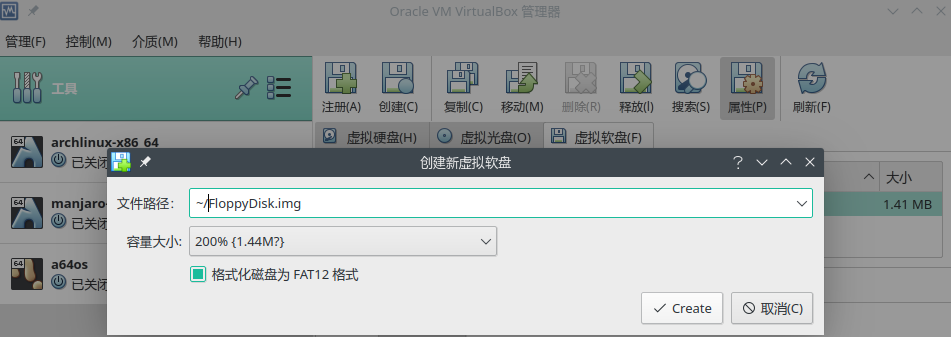
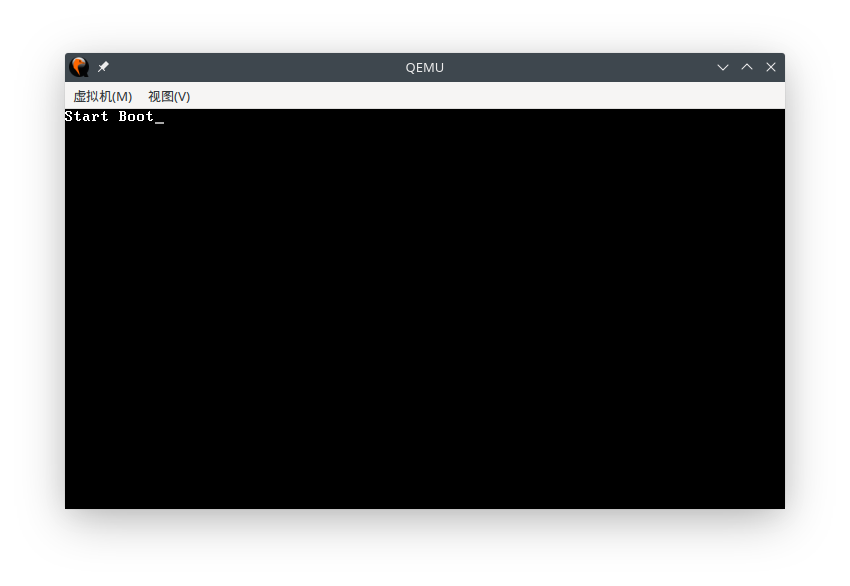
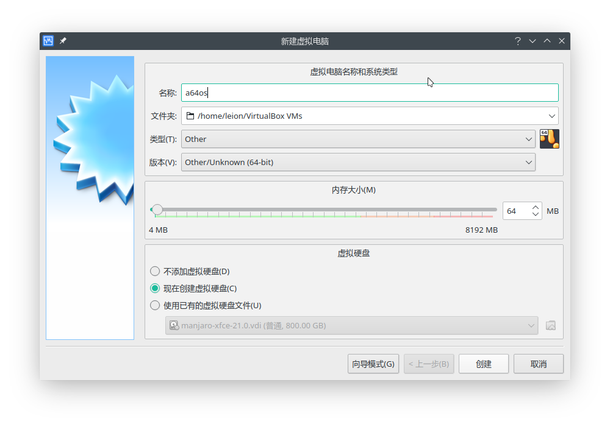
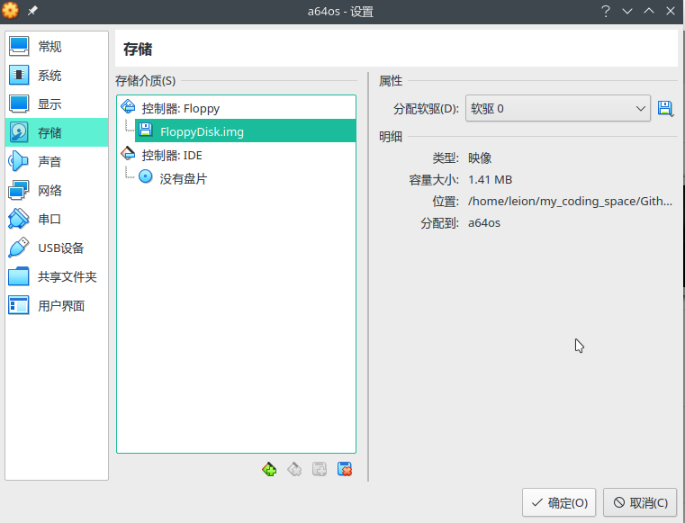
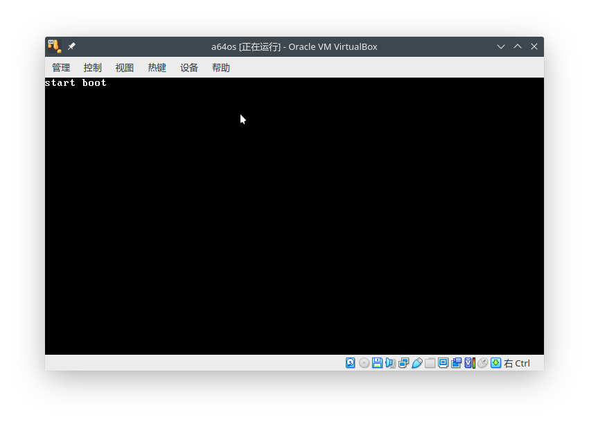
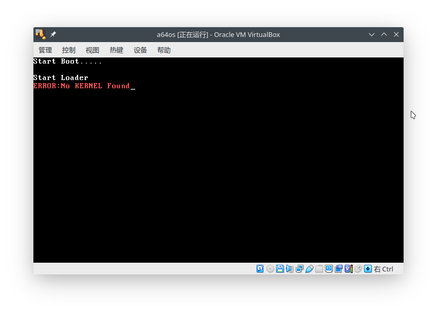

## 前置工作

创建软盘镜像：

> 1.41 MiB是通用的3.5英寸软盘的默认容量。

`dd if=/dev/zero of=FloppyDisk.img bs=1474560 count=1`
或者:
`qemu-img create -f raw FloppyDisk.img 1.41M`

建立FAT12文件系统（格式化软盘镜像）：

```shell
mkfs.vfat -F12 -S512 -s1 FloppyDisk.img
```

用Virtualbox创建虚拟软盘镜像：

工具->介质->虚拟软盘->点击“创建”按钮。



## C-03

BootLoader引导启动程序原本由Boot引导程序和Loader加载程序两部分构成。Boot引导程序主要负责开机启动和加载Loader程序；Loader引导加载程序则用于完成配置硬件工作环境、引导加载内核等任务。

### 引导器Boot

源码文件：

boot.asm

编译：

```shell
nasm boot.asm -o boot.bin
```

写入到镜像：

```shell
dd if=boot.bin of=FloppyDisk.img bs=512 count=1 conv=notrunc
```

> 接下来分别用两种虚拟机模拟器运行：

#### QEMU

```shell
sudo cp FloppyDisk.img /var/lib/libvirt/images
qemu-system-x86_64 -fda FloppyDisk.img
```



#### Virtualbox

用Virtualbox创建虚拟机：



设置->存储->添加控制器，软盘->添加虚拟软盘->选中刚才生成的FloppyDisk.img。



运行效果：



### 加载器Loader

源码文件：

loader.asm

编译：

```shell
nasm loader.asm -o loader.bin
```

>当loader.asm程序编译结束后，必须将生成的二进制程序loader.bin复制到虚拟软盘镜像中。虚拟软盘此前已被格式化为FAT12文件系统，那么应该借助挂载命令mount和复制命令cp，把引导加载程序loader.bin复制到文件系统中。

挂载镜像，拷贝进文件系统：

```shell
sudo mount FloppyDisk.img /run/media/ -t vfat -o loop
sudo cp loader.bin /run/media/
sync
sudo umount /run/media/
```

#### Virtualbox运行



#### QEMU模拟器运行

`qemu-system-x86_64 -boot a -fda FloppyDisk.img`
或者：
`qemu-system-x86_64 -drive file=FloppyDisk.img,format=raw,if=floppy`

